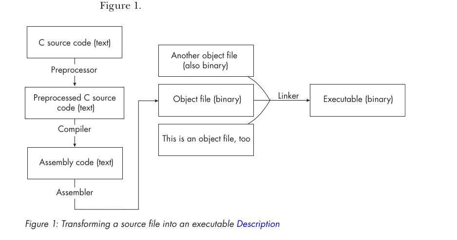
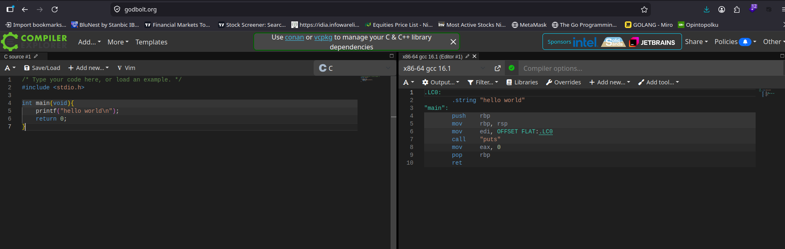
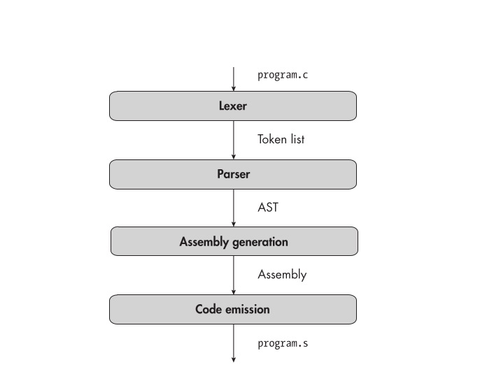

Write a compiler that translate our code to assembly
Differnt processor understands different instructions we will focus on: x64 instruction set also called x86-64 or AMD64 (popular)

### Notes:
- Most computer run AMD64
- Other type of instructions is ARM processors in tablets and smartphones.
- Processors can't understand `text`, so it cant run assembly code, hence we need to convert it to object code or binary instructions that the processor can decode.

e.g
- the assembly instruction `ret` corresponds to byte `0xc3`
- assembler handles the conversion, takes in the assembly code and spits out the object files.
- finally the linker combines all the object files, resolves references to variables.
- End result is an executable code
- The preprocessor runs before the compiler e.g #include #define
- Preprocessor strips out the comments, executes the the preprocessor directives like #include and expnad the macro to produce preprocessed codes
    that is ready for compilation




When you compile a program with command like gcc and clang, you are actually invoking a compiler driver, a small driver responsible for calling the:
- preprocessor
- compiler 
- assembler or linker

### Goal of this note:
- Write a compiler
- Write a compiler driver like gcc and clang
- We wont write a preprocessor, linker or assembler, we will use the version of the tool already installed in our system


#### Writing C compiler Test suite
https://github.com/nlsandler/writing-a-c-compiler-tests

Resources: the C standard and the documentation for the x64 instruction set 

### Requirements
Linux with x64 processor
Check CPU architecture: Run : `uname -m`


| Output         | Meaning                      |
| -------------- | ---------------------------- |
| `x86_64`       | 64-bit x86 processor (x64) ✅ |
| `aarch64`      | 64-bit ARM processor         |
| `i686`, `i386` | 32-bit x86 processor         |

Check the linux architecture
```bash
arch
```
You get: `x86_64`

### Get the cpu information
```bash
lscpu
```

### One liner
```bash
[ "$(uname -m)" = "x86_64" ] && echo "Linux x64" || echo "Not x64"
```

Check if you have GDB debugger
```bash
sudo apt install gdb gcc
gdb -v
gcc -v
```

### Validating Your Setup
The test script includes a 
--check-setup 
option that you can use to make sure your system is set up correctly. Run these commands to download the test
suite and validate your setup:
```bash
 git clone https://github.com/nlsandler/writing-a-c-compiler-tests.git
 cd writing-a-c-compiler-tests
 ./test_compiler --check-setup
```
All system requirements met!


### compiler Explorer Website to convert source file to assembly
https://godbolt.org/



### 4 Stages of Compiler aka 4 compiler passes
- Lexer -> program.c
- Parser -> Token list
- Assembly Generation AST -> Assembly
- Code emission -> program.s




### Lexer:
- Lexer breaks up the source code into a list of tokens.
- Tokens are the smallest syntatic unit of a program, they include delimeters, arithmetic symbols, keywords, and identifiers.
- If a program is a `book`, tokens are like individual `words`.

### The parser
- Converts the list of tokens to `Abstract syntax tree`.
- Which represents a program in a form we can easily traverse and analyze

### Assembly Generation pass
- Converts AST into assembly.
- At this stage, we still represent the assembly instructions in a data structure
that the compiler can understand, not as text.


### Code emission 
- pass writes the assembly code to a file so the assembler and linker can turn it into an executable.

## Note:
There can be more than these four stages.

### Compiling C to assembly with the C Compiler already installed
```c
int main(void){
    return 2;
}
```
```bash
gcc -S -O -fno-asynchronous-unwind-tables -fcf-protection=none main.c
```
This will generate a `.s` file
-O -> optimize the code. Eliminates instructions we arent concerned with now.
-S -> Don't run the assembler or linker. this makes the compiler emit assembly instead of a binary file
-fno-asynchronous-unwind-tables -> Don’t generate the unwind table, which is used for debugging. We don’t need it.
-fcf-protection=none -> Disable control-flow protection, a security feature that adds extra instructions we aren’t concerned with.
Control-flow protection might already be disabled by default on your system, in which case this option won’t do anything.
Skip this option if you’re using an old version of GCC or Clang that doesn’t support it.


```
   1   │     .file   "main.c"
   2   │     .text
   3   │     .globl  main
   4   │     .type   main, @function
   5   │ main:
   6   │     movl    $2, %eax
   7   │     ret
   8   │     .size   main, .-main
   9   │     .ident  "GCC: (Ubuntu 13.3.0-6ubuntu2~24.04.1) 13.3.0"
  10   │     .section    .note.GNU-stack,"",@progbits
```
- `.globl main` is the assembler directives, a statement that provides direction for assembler.
- Assembler directives always start with a period. 
- Here main is the symbol, a name for `memory address`. 
- Symbols appear in assembly instructions as well as assembler directives;
- for example, the instruction `jmp main` jumps to whatever address the main symbol refers to.
- The `.globl main` directive tells the assembler that main is a global symbol.
- By default, you can use a symbol only in the same assembly file.
- But because main is global, other object file can refer to it.


- On line 5, we use main as a label for the code that follows it. Labels consist of a string or number followed by a colon.
A label marks the location that a symbol refers to.
This particular label defines main as the address of the movl instruction on the following line. The assembler doesn’t
- `movl` instruction 


